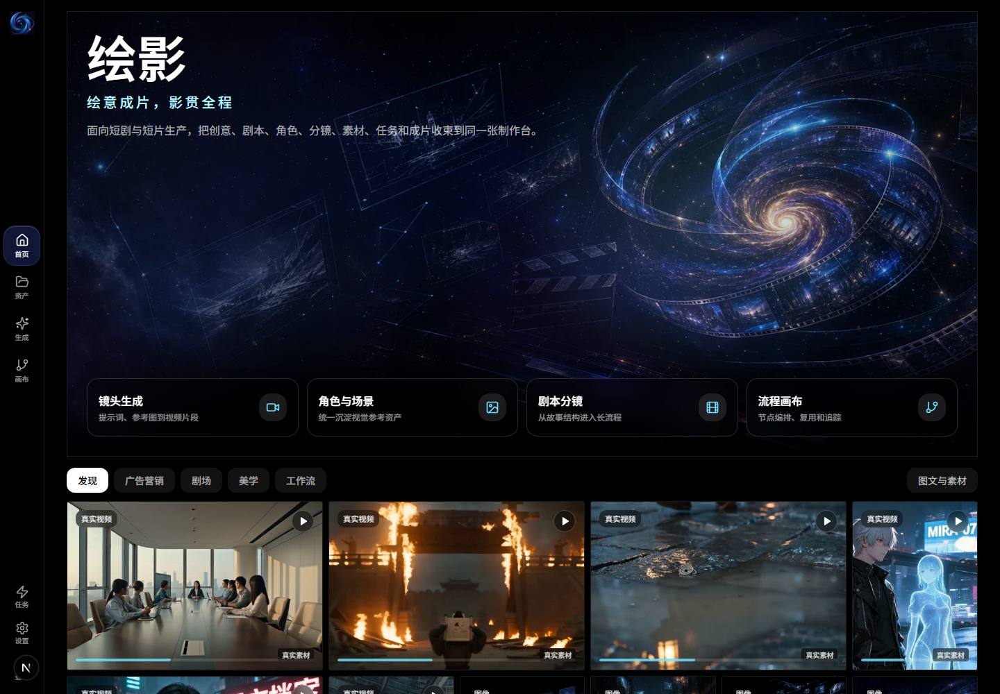

# SceneWeave

SceneWeave（绘影）is an AIGC short-film studio for story-aware segmented video generation, frame handoff, audio continuity, media asset management and recoverable production workflows.

它面向短剧、预告片和商业短片制作，把创意、剧本、角色、场景、道具、分镜、尾帧承接、声音状态、素材资产、任务恢复和成片交付收束到同一张制作台。



## Status

| Item | Value |
| --- | --- |
| Live demo | [airai.world/huiying](http://airai.world/huiying) |
| Runtime | `huiying.service` + `nginx` |
| Current health | Page, `/api/health`, media library and production-case APIs return 200 in the latest online probe. |
| Recent UX fixes | Media APIs are base-path aware under `/huiying`; gallery cards no longer preload whole videos; failed/old releases were cleaned up while keeping rollback capacity. |
| Stability boundary | This README records runtime, media display and task-interface health. Real Seedance/Seedream generation, fee confirmation and ViMAX main-chain behavior require the QA gates below. |

## What It Does

- **Short-film workbench**: move from idea, script, characters and scenes into storyboard, shots, tasks and deliverable assets.
- **Segmented video chain**: manage tail-frame handoff, segment recovery, merge failures and long-running task status.
- **Media library**: synchronize historical images, videos, posters and production cases; thumbnails load first and videos open on demand.
- **Task center**: queue long jobs with polling, SSE, cancel, retry and recovery behavior.
- **Workflow canvas**: keep scripts, storyboards, images, video, audio and review nodes in an auditable creative flow.

## Architecture

```text
Browser studio
  -> Next.js pages and API routes
  -> task center and production assembly queues
  -> provider boundary and model router
  -> media library, posters, object storage and generated assets
  -> QA scripts for duration, recovery, handoff and readiness gates
```

The product name is 绘影. The repository and English-facing description use SceneWeave for GitHub and package identity.

## Quick Start

```bash
pnpm install
pnpm dev
```

Open [http://localhost:5000](http://localhost:5000).

Production build:

```bash
pnpm build
pnpm start
```

## Configuration

| Area | Variables |
| --- | --- |
| Public app | `NEXT_PUBLIC_APP_BASE_PATH`, `HUIYING_BASE_URL` |
| Provider gateway | `OPENAI_COMPAT_*`, `ARK_*`, provider-specific API base/model variables |
| Real video QA | `HUIYING_REAL_ARK_API_BASE`, `HUIYING_REAL_ARK_API_KEY`, `HUIYING_REAL_ARK_VIDEO_MODEL`, `HUIYING_REAL_VIDEO_SECONDS`, `HUIYING_REAL_VIDEO_MAX_SECONDS`, `HUIYING_ALLOW_REAL_VIDEO_COST` |
| Object storage | `HUIYING_OBJECT_STORAGE_ENDPOINT_URL`, `HUIYING_OBJECT_STORAGE_BUCKET_NAME`, `HUIYING_OBJECT_STORAGE_ACCESS_KEY_ID`, `HUIYING_OBJECT_STORAGE_SECRET_ACCESS_KEY` |
| Public assets | `HUIYING_PUBLIC_ASSET_BASE_URL` |

Secrets belong in the local shell, CI secrets or the deployment platform. Do not commit API keys, tokens, generated videos, full signed URLs or backup release directories.

## Verification

Use the smallest check that matches the change:

```bash
pnpm run ts-check
pnpm run lint:build
pnpm validate
```

High-signal QA gates:

| Command | Purpose |
| --- | --- |
| `pnpm run qa:video-byok` | validate video route guardrails with dummy credentials; no real provider call |
| `pnpm run qa:production-readiness` | check whether the runtime has real segment-handoff prerequisites |
| `pnpm run qa:video-recovery` | verify failed merges preserve recoverable segment assets |
| `pnpm run qa:tasks` | verify task list, task detail, SSE waiting state, cancel, retry and recovery |
| `pnpm run qa:flow` | run the idea-to-storyboard dry-run and task writeback path |
| `pnpm run qa:video-duration -- artifacts/example.mp4` | parse the actual media duration instead of trusting task metadata |
| `pnpm run qa:real-video-gate` | run the ordered real-video gate only when private cost-control variables are explicitly set |
| `pnpm run qa:real-segment-handoff` | verify real two-segment tail-frame handoff; this calls the real provider and can incur cost |

Real provider tests must be opt-in, sequential and cost-gated. Do not run real 60s+ regressions without explicit approval and previous 5s smoke, two-segment handoff and object-storage readiness evidence.

## Product Boundaries

- Keep ViMAX main chain, fee confirmation, real Seedance/Seedream calls, video generation strategy, boundary bridge and short-drama acceptance logic isolated from unrelated UI polish.
- Long-running generation must enter the task system; buttons should not stay in unbounded loading states.
- For 1-minute+ video work, progress through low-cost validation: route/dry-run -> minimum text -> minimum image -> 5s -> 10s -> 15s -> 30s -> 60s -> 60s+.
- A video task is not verified until the result file is downloaded or probed and its actual media duration is parsed.

## Deployment

Production rollout should use release directories plus a current symlink, build before switching traffic, restart the service, probe public routes, and rollback immediately if health checks fail.

Minimal online probes:

```bash
curl -I http://airai.world/huiying
curl -s http://airai.world/huiying/api/health
curl -I http://airai.world/huiying/api/assets/media-library?limit=3
```

After any media or route change, also check representative static resources and their `Content-Type`; broken image/video cards often mean a media URL is returning HTML rather than the asset.

## Project Layout

```text
src/app/          Next.js App Router pages and API routes
src/components/   product panels, studio UI and shadcn/ui primitives
src/lib/          provider, media, task, production and storage utilities
scripts/          QA, smoke, recovery and release helper scripts
docs/             QA notes, rollout notes, source alignment and screenshots
```

## Development Notes

- Use `pnpm`; `npm` and `yarn` are intentionally blocked.
- Prefer existing product components and UI patterns before introducing new abstractions.
- Keep changes small around provider, task, media and ViMAX boundaries.
- Do not use broad formatting passes to fix unrelated files.
- If a change touches UI media loading, verify both the API response and representative asset `Content-Type`.

## Related Docs

- [Product function retention](docs/product-function-retention.md)
- [Production flow QA](docs/yh-production-flow-qa.md)
- [Task reliability QA](docs/yh-task-reliability-qa.md)
- [Source alignment loop](docs/yh-source-alignment-loop.md)
- [Open-source source-level gap analysis](docs/yh-open-source-source-level-gap-analysis.md)
- [Release entrypoint audit](docs/release-entrypoint-audit.md)

## Suggested GitHub Metadata

- Description: `AIGC short-film studio for story-aware segmented video generation, frame handoff, audio continuity, and recoverable production workflows.`
- Topics: `aigc`, `ai-video`, `short-film`, `storyboard`, `video-generation`, `frame-handoff`, `seedance`, `nextjs`

## Security

Do not open public issues containing secrets, private model credentials, generated-user media, full signed URLs or paid-provider request payloads. Report sensitive findings privately to the repository owner.
